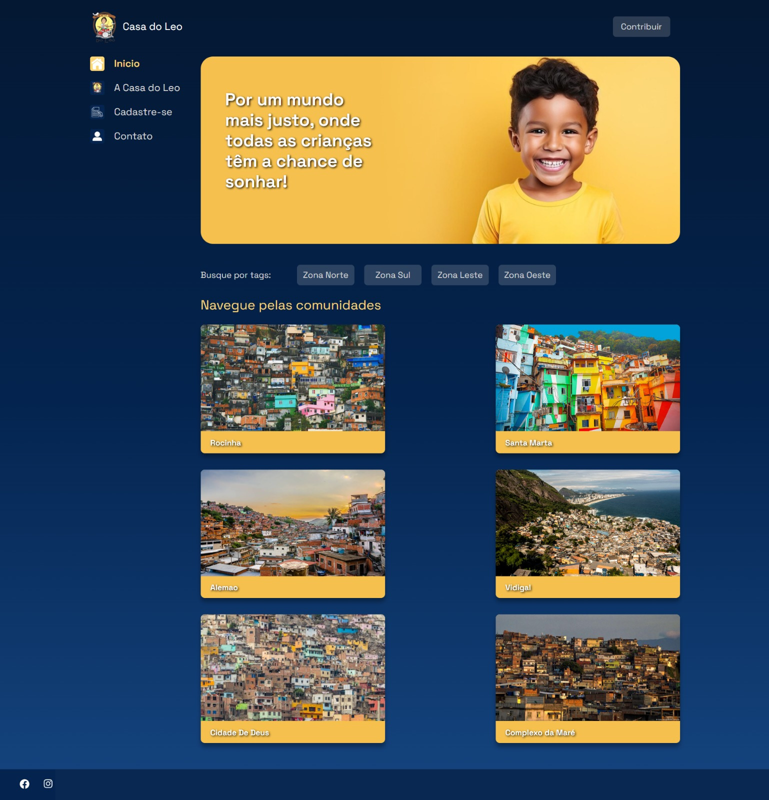

# Casa do Leo Website

This project is a website for Casa do Leo, a non-governmental organization (NGO) aimed at providing support and resources to underprivileged children. The website serves as a platform to showcase the organization's mission, activities, and ways for interested individuals to get involved or contribute.

## Table of Contents

- [Overview](#overview)
- [Features](#features)
- [Installation](#installation)
- [Usage](#usage)
- [Contributing](#contributing)
- [License](#license)

## Overview

The Casa do Leo website is built using the Django framework, incorporating HTML, CSS, and JavaScript for the front-end interface. It includes features such as user authentication, a blog section for sharing updates and stories, a donation page, and a contact form for inquiries.

## Screenshots

*Description: This is the homepage of the Casa do Leo website.*

## Features

- **User Authentication:** Allows users to sign up, log in, and manage their accounts.
- **Blog Section:** Provides a platform for publishing articles, updates, and stories related to Casa do Leo's activities and impact.
- **Donation Page:** Offers visitors the option to make monetary contributions to support the organization's initiatives.
- **Contact Form:** Enables users to reach out to Casa do Leo for inquiries, partnerships, or volunteering opportunities.

## Installation

To run the Casa do Leo website locally, follow these steps:

1. Clone this repository to your local machine using `git clone`.
2. Navigate to the project directory.
3. Install the required dependencies by running `pip install -r requirements.txt`.
4. Apply migrations to set up the database: `python manage.py migrate`.
5. Create a superuser account for accessing the Django admin interface: `python manage.py createsuperuser`.
6. Start the development server: `python manage.py runserver`.

## Usage

Once the development server is running, you can access the Casa do Leo website by visiting `http://localhost:8000` in your web browser. From there, you can explore the various sections of the website, sign up or log in if you have an account, read blog posts, make donations, and contact Casa do Leo for more information.

## Contributing

Contributions to the Casa do Leo website are welcome! If you would like to contribute to the project, please follow these steps:

1. Fork the repository on GitHub.
2. Create a new branch with a descriptive name for your feature or bug fix.
3. Make your changes and test them thoroughly.
4. Commit your changes with a clear and descriptive commit message.
5. Push your changes to your forked repository.
6. Submit a pull request, explaining the changes you've made and any relevant information.

## License

The Casa do Leo website is open-source software licensed under the [MIT License](LICENSE). Feel free to use, modify, and distribute the code for your own purposes.
